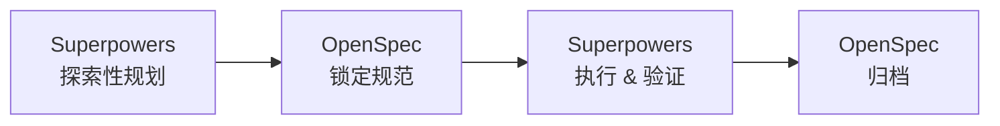

# AGENTS.md — 多 Agent 协同工作规范

> 本文件是 **agent-gateway** 项目所有协同工作的强制规范。
> 所有步骤默认采用多个 Agent 并行/协同工作以提高效率；下方规则基于本项目实际验证过的模式（设计阶段 5 子代理并行起草 + 4 轮评审已落地，见 `docs/superpowers/specs/2026-08-12-agent-gateway-design.md` 提交历史）。
> **人读也适用**：本文件对人类协作者同样有效。

---

## 0. 核心原则

1. **默认并行，例外串行**：任何可独立的工作，必须派多个子代理并行；只有存在真实依赖或共享可变状态时才串行。
2. **并行≠失控**：并行前先切分边界、定义每个 agent 的输入/输出契约，再 fan-out。
3. **整合是主线 agent 的职责**：子代理产出"可拼入的片段"，主线（orchestrator）负责整合、统一术语、消除冲突、保证一致性。
4. **诚实标注串行场景**：不为并行而并行。下列情况必须串行（见 §3），强行并行只会制造冲突与返工。

---

## 1. 何时必须并行（FASTER）

满足以下任一条件，**必须**派多 agent 并行（在同一条消息里发出多个 Agent 调用）：

| 场景 | 典型例子 | 切分维度 |
|---|---|---|
| **多模块/多文件起草** | 16 个平台模块的设计文档 | 按模块簇切，每 agent 一簇 |
| **多维度评审** | 安全/性能/一致性/完整性同时审 | 每 agent 一个维度 |
| **多候选方案探索** | 3 种架构方案对比 | 每 agent 深挖一种 |
| **独立模块的实现** | A2A 客户端 / 会话存储 / RBAC 各自编码 | 按 Maven 模块切 |
| **多文件的搜索/理解** | 全仓库梳理 6 大组件边界 | 按目录/主题切 |

**判定法**：问自己"这几件事之间，有没有一个必须等另一个完成才能开始？" —— 没有 → 并行。

---

## 2. 已验证的协同模式（本项目实战）

### 模式 A：并行起草 + 主线整合（设计/文档类）

```
                    主线 agent
                   (orchestrator)
                        │
          ┌─────────────┼─────────────┐
          ▼             ▼             ▼
     worker-a       worker-b       worker-c    ← 并行起草
     (模块簇1)      (模块簇2)      (模块簇3)      产出 Markdown 片段
          └─────────────┼─────────────┘
                        ▼
              主线整合：统一术语、
              消除错误码冲突、补交叉引用
                        │
                        ▼
              评审 agent（见模式 B）
```

**本项目实证**：§14-§29 共 16 个模块，由 5 个 `backend-architect` 子代理并行起草，主线整合后产出 1777 行设计文档。要点：
- 每个 worker 先 `Read` 同一份背景 spec 对齐术语，**再**产出——否则术语漂移。
- worker 只输出"可粘贴片段"，不寒暄、不解释。
- 主线必须做**冲突扫描**（本项目曾发现 3 个子代理用了同一段错误码，整合时统一规划为 `GW-1xxx~45xx`）。

### 模式 B：多轮评审循环（质量类）

```
起草完成 → 派 spec-document-reviewer → Issues Found?
              │                            │ 是
              │ 修复 ◀─────────────────────┤
              │                            │ 否
              ▼                            ▼
          Approved                     再派评审（验证修复）
```

**本项目实证**：4 轮评审，每轮派一个 `general-purpose` 评审 agent 读取全文、按维度打分、引用行号给证据。要点：
- 评审 agent **只读**，绝不自己改文件——改是主线的事。
- 每轮评审 prompt 要带上"上轮发现了什么、本轮验证什么"，形成闭环。
- 设熔断：超过 5 轮未收敛，停下来找人类（见 §5）。

### 模式 C：并行 + 汇总（研究/搜索类）

```
        研究/搜索任务
             │
   ┌─────────┼─────────┐
   ▼         ▼         ▼
 角度A      角度B      角度C    ← 每 agent 不同搜索角度
 (按容器)  (按内容)  (按实体)
   └─────────┼─────────┘
             ▼
       主线去重 + 综合
```

用于"一种搜索方式找不全"的场景（如全仓库梳理、技术选型调研）。

---

## 3. 何时必须串行（SAFER）

以下场景**禁止并行**，否则制造冲突、数据丢失或逻辑错误：

| 场景 | 原因 | 正确做法 |
|---|---|---|
| **修改同一文件** | 并行写会互相覆盖 | 串行编辑，或 worktree 隔离 |
| **有真实依赖的步骤** | B 依赖 A 的输出 | A 完成后再派 B |
| **git 提交/分支操作** | 并行 commit 会冲突 | 主线统一提交 |
| **评审 → 修复** | 必须先有评审结论 | 串行（评审完才改） |
| **共享可变状态** | 竞态 | 加锁或串行 |
| **环境变更（装依赖/迁移）** | 副作用全局 | 串行，且尽量由主线做 |

**判定法**：问自己"这几件事会不会踩同一份文件/同一个状态？" —— 会 → 串行。

---

## 4. Agent 切分方法

切分质量决定并行收益。按优先级使用以下切分维度：

1. **按领域模块**（首选）：A2A / 会话 / RBAC / 成本 / 审计……天然边界清晰。
2. **按文件**：一个 agent 负责一组不重叠的文件。
3. **按维度**：评审时按 安全/性能/一致性/完整性 切。
4. **按阶段**：起草 / 评审 / 整合 各派不同角色 agent。

**切分自检**（每个子任务应能回答）：
- 输入是什么？（背景文档、参考代码）
- 输出是什么？（可粘贴片段、结构化结论、修改后的文件）
- 边界在哪？（只碰哪些文件、不碰哪些）
- 依赖谁？（是否需要先读某份 spec 对齐）

切不清就别并行——先串行把边界理清。

---

## 5. 协同协议

### 5.1 派发（fan-out）
- 独立的 agent 调用，**放在同一条消息里**并发送出（不要一个一个等）。
- 每个 agent 的 prompt 必须包含：背景（先读哪份文件对齐）、明确任务、输出格式、边界约束。
- 给 agent 起有意义的 `name`，便于追溯。

### 5.2 整合（fan-in）
- 子代理返回的是**原始数据/片段**，不是面向人的消息——主线负责改写、去重、统一。
- 整合必做：术语统一、冲突扫描（错误码/命名/接口路径）、交叉引用补全。
- 整合后产物需自洽（一个读者从任意章节进入都能理解）。

### 5.3 一致性保障
- **共享背景**：所有并行 agent 先读同一份"对齐文档"（如 spec、架构约定）。
- **命名规约**：错误码、接口路径、record 字段全项目统一（见 spec §13.4、§3.3）。
- **冲突归主线**：子代理产出冲突时，由主线裁决并记录决策。

### 5.4 熔断与人类介入
- 评审循环超过 **5 轮**未收敛 → 停下，找人类决策。
- 并行 agent 出现大面积术语漂移 → 停下，先补一份更强的对齐文档再重派。
- 遇到 §3 的串行场景被误并行 → 立即串行化重来。

---

## 6. 本项目可用 Agent 角色

派发时按任务选 `subagent_type`：

| 角色 | 适用任务 | 对应 subagent_type |
|---|---|---|
| 后端架构师 | 架构设计、模块边界、领域模型 | `backend-architect` |
| 后端开发 | 模块实现（TDD） | `backend-developer` |
| 通用研究/评审 | 多步研究、文档评审 | `general-purpose` |
| 广度搜索 | 全仓库梳理、定位代码 | `Explore` |
| 领域专家 | 业务领域反馈（大型改造） | `domain-expert` |
| 集成测试 | 端到端验证 | `integration-tester` |

> 完整角色清单见会话开头的 available agent types。选用时确保角色的工具集匹配任务（如评审要只读，别用能写文件的角色）。

---

## 7. 示例：本项目设计阶段是如何协同的

> 这是真实发生的过程，可作为后续阶段的模板。

**任务**：把网关 spec 从 9 章扩展到企业级平台（§12-§29，16 个新模块）。

**做法**：
1. 主线先与用户确认模块全景 + 优先级分层（§13），定下"设计全覆盖、实现分阶段"。
2. 按**模块簇**切 5 份，派 5 个 `backend-architect` 并行：
   - worker-a：Agent 目录 + 生命周期
   - worker-b：管理后台核心（租户/模型/Key/RBAC/配置）
   - worker-c：成本中心 + 审计
   - worker-d：开放 API + IM + Webhook
   - worker-e：RAG + 审核 + 工作流 + 开发者区
3. 每个 worker 先 `Read` 同一份 spec 对齐术语，产出可粘贴 Markdown。
4. 主线整合：统一错误码段（`GW-1xxx~45xx`，解决 3 个 worker 的撞码）、补交叉引用、扩充术语表。
5. 派评审 agent，4 轮循环直到 Approved，每轮修复后重派验证。

**结果**：单次扩展产出 1777 行高质量设计文档，耗时远低于串行起草。

---

## 8. 检查清单（派发前过一遍）

- [ ] 任务是否可独立？能独立 → 准备并行（§1）
- [ ] 是否踩同一文件/同一状态？是 → 串行（§3）
- [ ] 切分边界清楚吗？每个子任务能回答输入/输出/边界/依赖（§4）
- [ ] 共享背景文档指定了吗？所有 agent 对齐同一份（§5.3）
- [ ] 整合与一致性谁负责？主线 agent（§5.2）
- [ ] 串行场景是否已识别并隔离（§3）

全部打勾 → 派发。任一存疑 → 先串行理清，再决定是否并行。


# OpenSpec + Superpowers 项目开发标准流程

## 1. 概述

本文档定义了一套基于 **OpenSpec + Superpowers** 三段式工作流的项目开发标准。  
其核心目标是将需求探索、规范锁定、实现验证与归档四个阶段强制解耦，确保每一次行为变更都有清晰的规范依据、可追溯的决策记录和可验证的质量保证。

**适用范围**：所有涉及行为变更（新功能、重构、缺陷修复等）的开发任务，建议在团队内统一执行。

**语言要求**: 用简体中文回复

## 2. 核心概念

| 概念 | 说明 |
|------|------|
| **Superpowers** | 探索与实现阶段的 AI 协作模式，用于需求挖掘、方案比较、编码、测试和真实验证。 |
| **OpenSpec** | 规范锁定与归档模式，用于创建变更提案（proposal）、设计文档（design）、规格说明（spec）和任务拆解（tasks），并在验证通过后完成归档。 |

## 3. 工作流总览



- **阶段一**：Superpowers 探索性规划（需求探索、方案比较、设计确认）  
- **阶段二**：OpenSpec 锁定规范（proposal / design / spec / tasks）  
- **阶段三**：Superpowers 执行编码、测试、验证  
- **阶段四**：OpenSpec 归档（对齐检查、文档入库）

**关键闸门**：
- 设计未经确认，**禁止**进入阶段二。
- OpenSpec 四件套（proposal / design / spec / tasks）未完成，**禁止**进入阶段三。
- 代码、测试与规范未对齐，**禁止**进入阶段四。

## 4. 阶段详细说明

### 阶段一：探索性规划（Superpowers）

**目标**：完成需求理解、方案设计与可行性确认，输出设计草稿。

**活动**：
- 解读需求，澄清边界条件与验收标准。
- 探索至少两种可行方案，并给出优缺点比较。
- 与相关方（产品、架构、同行开发者）进行设计确认。
- 产出**设计草稿**（形式不限，但需包含核心思路、关键决策与备选理由）。

**退出条件**：
- 设计已获得明确确认（口头或书面）。
- 设计草稿可供下一阶段直接转化为 OpenSpec 文档。

**禁止项**：
- 不创建 OpenSpec change。
- 不编写提案、设计文档、规格或任务列表。
- 不编写任何代码。

### 阶段二：锁定规范（OpenSpec）

**目标**：将确认的设计固化为可追溯、可评审、可复现的规范制品。

**必须产出的四件套**：

| 制品 | 文件 | 内容要求 |
|------|------|----------|
| 提案 | `proposal.md` | 变更动机、范围、影响与风险 |
| 设计 | `design.md` | 架构、模块、接口、数据流、关键技术决策 |
| 规格 | `spec.md` | 行为规格，可测试的需求条款 |
| 任务 | `tasks.md` | 可执行、可验证的任务清单，按依赖排序 |

**活动**：
- 基于设计草稿创建 OpenSpec change（在对应的 spec 仓库或目录下）。
- 编写并内审上述四个文档，确保一致性和可测试性。
- 冻结规范，此后任何需求变更必须走单独的变更流程。

**退出条件**：
- 四件套均已创建，且通过指定评审角色的确认。
- 任务清单中的每一项都满足“可独立验证、可估算工作量”。

### 阶段三：执行与验证（Superpowers）

**目标**：严格依照 OpenSpec 规范，以 TDD 方式实现需求，并通过真实验证。

**活动**：
- 编写**实现计划**（可从 tasks.md 衍生或细化）。
- 使用独立工作空间（例如 git worktree）隔离开发。
- 遵循 **TDD（测试驱动开发）** 循环：
  1. 依据 `spec.md` 编写一个失败的测试。
  2. 编写最小实现使测试通过。
  3. 重构优化，保持测试全绿。
- 每次提交前执行**真实验证命令**（项目构建、测试套件、端到端检查、lint 等，根据项目定义）。
- 完成 `tasks.md` 中所有任务项。

**退出条件**：
- 所有任务已完成勾选。
- 全量测试通过，真实验证命令运行成功。
- 代码已合入目标分支（或处于可合入状态）。

### 阶段四：归档（OpenSpec）

**目标**：确认代码、测试与规范完全对齐，并将本次变更归档为组织资产。

**活动**：
- 对照 `spec.md` 逐条核验实现行为。
- 检查测试覆盖是否符合规格要求。
- 补齐过程中产生的文档缺口。
- 将 OpenSpec change 标记为完成并归档（移动至 `archive/` 或对应的文档库路径）。

**退出条件**：
- 审查检查清单全部通过（见第6节）。
- OpenSpec 归档操作完成，版本可追溯。

## 5. 强制规则

1. **设计未确认，不进入 OpenSpec**。任何模糊、未决的设计讨论，不得提前产出提案。
2. **OpenSpec 四件套未完成，不进入编码**。缺少 proposal / design / spec / tasks 中任一文档，禁止开始编写生产代码。
3. **行为变更默认使用 TDD**。除非任务本身仅涉及非功能性需求（如文档、构建脚本），否则必须先写失败测试。
4. **完成前必须运行真实验证命令**。验证命令必须由项目统一约定，确保在本地或 CI 中可重复执行。
5. **代码、测试、规范未对齐前，不归档**。任何不一致必须在归档前修正或显式记录偏差理由。

## 6. 审查检查清单

进入归档阶段前，必须逐项确认以下清单（建议由开发者自查后，再由评审者复核）：

- [ ] 是否已完成 Superpowers 探索？
- [ ] 是否有设计草稿？
- [ ] 是否已创建 OpenSpec change？
- [ ] 是否存在 `proposal.md`？
- [ ] 是否存在 `design.md`？
- [ ] 是否存在 `spec.md`？
- [ ] 是否存在 `tasks.md`？
- [ ] 是否编写了实现计划？
- [ ] 是否补充了测试（TDD 循环记录）？
- [ ] 是否运行了真实验证命令且全部通过？
- [ ] `tasks.md` 中的所有任务是否已完成（勾选）？
- [ ] 代码、测试与规格是否存在不一致？
- [ ] 是否已完成 OpenSpec 归档操作？

## 7. 附录：术语约定

| 术语 | 定义 |
|------|------|
| **真实验证命令** | 由项目定义的、能在真实或模拟环境中证明功能正确性的命令，例如 `npm test && npm run e2e`、`pytest --maxfail=1` 等。 |
| **OpenSpec change** | 一次变更对应的目录或逻辑单元，内含 proposal / design / spec / tasks 文件。 |
| **设计草稿** | 探索阶段的非正式设计产出，用于对齐理解，不作为长期基线。 |
| **TDD** | Test-Driven Development，测试驱动开发：红 → 绿 → 重构。 |

---

## 8. 落地：本项目目录与文件承载

> 本节把上面的四阶段工作流与「多 Agent 协同规范（§0-§8 前半）」对应到本项目的**真实文件路径**。两个规范合一，协同执行。

### 8.1 目录结构

```
agent-gateway/
├── AGENTS.md                           协同规范（本文件，§0-§8 多Agent + OpenSpec 四阶段）
├── openspec/                           OpenSpec 轻量结构
│   ├── README.md                        结构说明
│   ├── PROPOSAL.md                      项目级提案（动机/范围/风险/成功标准/路线）
│   └── changes/<change-name>/           每个变更一个文件夹
│       ├── proposal.md                   本变更 what/why/范围/验收
│       ├── design.md                     本变更技术决策
│       └── tasks.md                      任务清单视图（详细 step 指向 plans/）
├── docs/superpowers/
│   ├── specs/                           技术设计文档（项目 design 角色）
│   │   └── 2026-08-12-agent-gateway-design.md   ★ 1777 行，4 轮评审
│   └── plans/                           可执行实现计划（变更 tasks 详细 step 角色）
│       └── 2026-08-12-foundation.md              ★ Plan① 1513 行，3 chunks Approved
```

### 8.2 四件套 Gate（阶段二→三）

一个 change 进入实现（阶段三 TDD 编码）前，`openspec/changes/<name>/` 下 **proposal.md + design.md + tasks.md 必须齐全且通过评审**（派 plan-document-reviewer / spec-document-reviewer 子代理评审，见 §5.4 熔断）。

> **行为规格（specs/ 可测试条款）暂渐进**：当前以 `docs/superpowers/specs/` 的设计文档承载，后续按能力（session/registry/model/iam/orchestration…）拆分可测试 SHALL 条款，作为 TDD 权威需求源。

### 8.3 当前状态

| Change | 文件夹 | 状态 |
|---|---|---|
| `add-foundation-skeleton` | `openspec/changes/add-foundation-skeleton/` | ✅ 已完成（阶段四归档，12 Task 双阶段评审通过） |
| `add-a2a-and-discovery` | `openspec/changes/add-a2a-and-discovery/` | ✅ 已完成（22 测试，AgentCardPort + ToolPort，bootstrap 接线） |
| `add-session-store` | `openspec/changes/add-session-store/` | ✅ 已完成（SessionRepository 端口 + InMemory/Redis） |
| `add-multi-model` | `openspec/changes/add-multi-model/` | ✅ 已完成（54 测试，Flow 适配+failover+多 Provider，bootstrap 接线） |

### 8.4 多 Agent 协同与 OpenSpec 的关系

- **多 Agent 协同规范（§0-§8 前半）** 管「**怎么做**」：何时并行/串行、如何切分、如何整合评审。
- **OpenSpec 四阶段（上文章节）** 管「**做什么、何时做**」：探索→锁定规范→执行→归档的阶段 gate。
- 二者结合：每个阶段内部用多 Agent 协同（如阶段二并行起草多 change 的四件套、阶段三并行实现独立模块），阶段之间用 OpenSpec gate 把关。
---

## 9. 用户提示词包含「长任务」时的执行规则

**触发条件**：用户提示词中包含「长任务」三字（含变体如「长任务啊」「继续长任务」「长任务开始」等模糊命中）。

**核心规则**：从触发起本次会话结束，**主线 agent 一律按建议方式执行**——不再出现中间询问过程（如"请选择 A/B/C/D"）。

具体含义：

1. **直接采纳上一条汇报末尾的「推荐选项」**，不再询问"是否继续"。
2. **每完成一个里程碑/阶段**，默认推进到下一阶段（除非遇到阻塞：错误、熔断、用户明确说停）。
3. **遇到模糊选择**时，按"主线裁决"原则自主决定并记录理由（不逐一询问），决定后继续推进。
4. **遇到环境/sandbox/subagent 失败**时，主线直接接管（改主线直写、跳过 subagent 派发），不汇报"是否切换策略"。
5. **阶段三/阶段四 之间的 Gate 评审**，若 subagent 派发失败，**主线自评 + 直接给 Approved/Needs major revision 结论**（不阻塞整体推进）。
6. **仅在用户明确说"停"/"暂停"/"review"/"先看看"**时，才中断并生成汇报。

例外（本规则不适用，仍按常规询问）：
- 关键架构决策首次出现（如选 MongoDB vs PostgreSQL、引入新基础设施）
- 破坏性操作不可逆（如 `git push --force`、删除主分支）
- 用户在提示词中显式要求"先问我"或"列出选项"

> **本规则来源**：D2 立项期间观察到的「subagent 频繁无报告失败 + 主线反复汇报选择」会打断推进节奏，且用户已显式偏好"按建议执行"的长任务风格。
